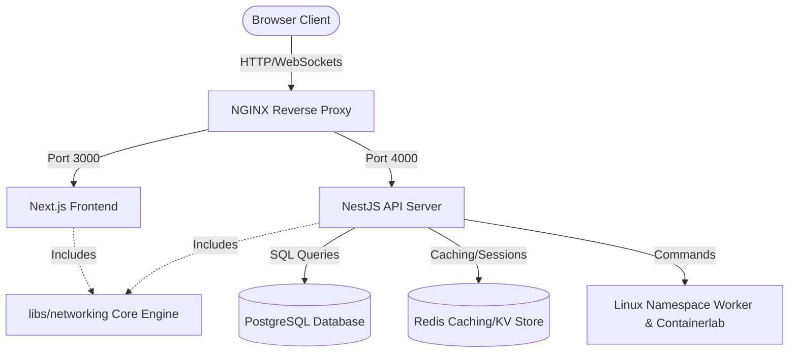
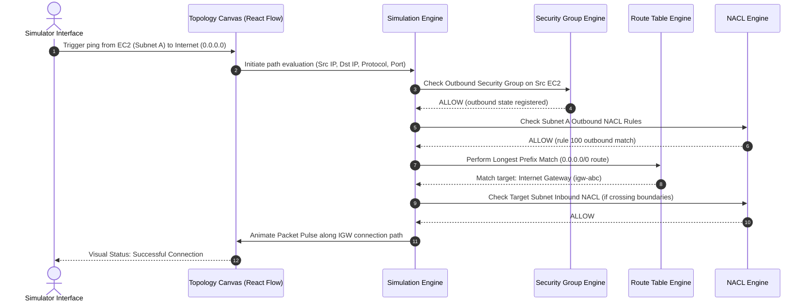

# Implementation Plan: IP Intelligence Platform

The **IP Intelligence Platform** is a web-based educational and interactive networking platform. It combines features of CIDR/VLSM calculators, visual VPC designers (similar to Cloudcraft/AWS VPC Designer), network simulators (similar to Cisco Packet Tracer), and real-world tools like Linux network namespaces and Containerlab.

---

## Architecture Overview

We will design this platform using a monorepo structure containing the following components:
1. **Frontend (`apps/web`)**: Next.js 15 (React 19), TypeScript, TailwindCSS, React Flow (for VPC/Topology Canvas), D3.js (for network trees and heatmaps), Framer Motion (for smooth micro-animations), and Monaco Editor (for JSON/YAML export configs and interactive route table editing).
2. **Backend (`apps/server`)**: NodeJS & NestJS, PostgreSQL (via Prisma ORM) for project/IPAM data storage, and Redis for rate-limiting, authentication tokens, and caching.
3. **Core Engine (`libs/networking`)**: A modular TypeScript library containing core networking mathematical engines (IPv4/IPv6, CIDR, VLSM, Supernetting, route lookup with Longest Prefix Match, stateful Security Group simulation, stateless Network ACL simulation, packet forwarding engine, and troubleshooting troubleshooter).



---

## User Review Required

Please review the proposed design decisions below. If you have specific preferences, let me know before approving this plan:

> [!IMPORTANT]
> **Containerlab & Linux Namespace Integration Requirement**
> Containerlab and Linux namespaces require a Linux environment with root access. In Windows development workspaces, we will mock the Linux execution or run it in a WSL2/Docker container. The NestJS backend will detect the OS and gracefully fall back to a simulation agent if Docker/WSL2 or root permissions are missing.

> [!TIP]
> **React 19 & Next.js Framework Selection**
> We will use Next.js 15 (which uses React 19) for the frontend. We will use Client-Side Rendering (CSR) for the interactive React Flow canvas and D3 visuals, and Server-Side Rendering (SSR) for static content like the Education Mode.

---

## Database Schema (Prisma Schema Draft)

The database will store projects, organizations, IPAM inventories, device state, and simulation configurations.

```prisma
datasource db {
  provider = "postgresql"
  url      = env("DATABASE_URL")
}

generator client {
  provider = "prisma-client-js"
}

enum Role {
  USER
  ADMIN
  ORGANIZATION_ADMIN
}

model User {
  id            String         @id @default(uuid())
  email         String         @unique
  passwordHash  String
  role          Role           @default(USER)
  createdAt     DateTime       @default(now())
  updatedAt     DateTime       @updatedAt
  projects      Project[]
  organizations Organization[]
}

model Organization {
  id        String    @id @default(uuid())
  name      String
  users     User[]
  projects  Project[]
  createdAt DateTime  @default(now())
}

model Project {
  id             String         @id @default(uuid())
  name           String
  description    String?
  ownerId        String
  owner          User           @relation(fields: [ownerId], references: [id])
  organizationId String?
  organization   Organization?  @relation(fields: [organizationId], references: [id])
  vpcs           Vpc[]
  ipPools        IpPool[]
  devices        Device[]
  createdAt      DateTime       @default(now())
  updatedAt      DateTime       @updatedAt
}

model Vpc {
  id          String       @id @default(uuid())
  name        String
  cidrBlock   String
  projectId   String
  project     Project      @relation(fields: [projectId], references: [id], onDelete: Cascade)
  subnets     Subnet[]
  routeTables RouteTable[]
  naclList    Nacl[]
  createdAt   DateTime     @default(now())
  updatedAt   DateTime     @updatedAt
}

model Subnet {
  id           String      @id @default(uuid())
  name         String
  cidrBlock    String
  vpcId        String
  vpc          Vpc         @relation(fields: [vpcId], references: [id], onDelete: Cascade)
  routeTableId String?
  routeTable   RouteTable? @relation(fields: [routeTableId], references: [id])
  naclId       String?
  nacl         Nacl?       @relation(fields: [naclId], references: [id])
  ips          IpAddress[]
  devices      Device[]
  createdAt    DateTime    @default(now())
  updatedAt    DateTime    @updatedAt
}

model RouteTable {
  id        String   @id @default(uuid())
  name      String
  vpcId     String
  vpc       Vpc      @relation(fields: [vpcId], references: [id], onDelete: Cascade)
  routes    Route[]
  subnets   Subnet[]
  isDefault Boolean  @default(false)
}

model Route {
  id           String     @id @default(uuid())
  routeTableId String
  routeTable   RouteTable @relation(fields: [routeTableId], references: [id], onDelete: Cascade)
  destination  String     // e.g. "0.0.0.0/0"
  target       String     // e.g. "local", "igw-12345", "nat-12345", "vgw-12345"
  priority     Int        @default(100)
}

model Nacl {
  id      String     @id @default(uuid())
  name    String
  vpcId   String
  vpc     Vpc        @relation(fields: [vpcId], references: [id], onDelete: Cascade)
  rules   NaclRule[]
  subnets Subnet[]
}

model NaclRule {
  id          String   @id @default(uuid())
  naclId      String
  nacl        Nacl     @relation(fields: [naclId], references: [id], onDelete: Cascade)
  ruleNumber  Int
  isIngress   Boolean
  protocol    String   // "ALL", "TCP", "UDP", "ICMP"
  portRange   String   // e.g. "80", "1-65535"
  cidrBlock   String   // Source/Dest CIDR
  action      String   // "ALLOW", "DENY"
}

model SecurityGroup {
  id          String   @id @default(uuid())
  name        String
  description String?
  rules       SgRule[]
  devices     Device[]
}

model SgRule {
  id              String        @id @default(uuid())
  securityGroupId String
  securityGroup   SecurityGroup @relation(fields: [securityGroupId], references: [id], onDelete: Cascade)
  isIngress       Boolean
  protocol        String        // "TCP", "UDP", "ICMP", "ALL"
  portRange       String        // e.g. "22"
  cidrBlock       String?       // IP CIDR source/destination
  sourceGroupId   String?       // Group reference for chain evaluation
}

model IpPool {
  id          String      @id @default(uuid())
  name        String
  cidrBlock   String
  projectId   String
  project     Project     @relation(fields: [projectId], references: [id], onDelete: Cascade)
  addresses   IpAddress[]
}

model IpAddress {
  id        String   @id @default(uuid())
  ip        String
  status    String   // "ALLOCATED", "RESERVED", "LOCKED"
  subnetId  String?
  subnet    Subnet?  @relation(fields: [subnetId], references: [id])
  poolId    String?
  pool      IpPool?  @relation(fields: [poolId], references: [id])
  deviceId  String?
  device    Device?  @relation(fields: [deviceId], references: [id])
  notes     String?
  updatedAt DateTime @updatedAt
}

model Device {
  id              String         @id @default(uuid())
  name            String
  type            String         // "EC2_INSTANCE", "NAT_GATEWAY", "INTERNET_GATEWAY", "TRANSIT_GATEWAY", "ROUTER"
  projectId       String
  project         Project        @relation(fields: [projectId], references: [id], onDelete: Cascade)
  subnetId        String?
  subnet          Subnet?        @relation(fields: [subnetId], references: [id])
  securityGroupId String?
  securityGroup   SecurityGroup? @relation(fields: [securityGroupId], references: [id])
  ipAddresses     IpAddress[]
  createdAt       DateTime       @default(now())
}
```

---

## API Design (REST Endpoints)

### 1. Calculation & Visualization API (`/api/v1/network`)
- `POST /api/v1/network/calculate-ip`: Calculate properties of a single IPv4/IPv6 address.
- `POST /api/v1/network/cidr`: Subnet CIDR calculation (network, wildcard, usable addresses).
- `POST /api/v1/network/vlsm`: Calculate VLSM subnet scheme given a list of host requirements.
- `POST /api/v1/network/supernet`: Combine network ranges into a single summary route.
- `POST /api/v1/network/validate`: Validate subnet distribution, overlapping IP blocks.

### 2. IPAM API (`/api/v1/ipam`)
- `GET /api/v1/ipam/projects`: List projects.
- `POST /api/v1/ipam/projects`: Create project.
- `GET /api/v1/ipam/projects/:id/topology`: Get network topology representation (nodes & edges).
- `POST /api/v1/ipam/ips/allocate`: Allocate IP from pool/subnet.
- `POST /api/v1/ipam/ips/release`: Release IP address.
- `POST /api/v1/ipam/ips/lock`: Reserve or lock an IP.

### 3. Simulation API (`/api/v1/simulator`)
- `POST /api/v1/simulator/packet-flow`: Trace a simulated packet from source to destination inside a virtual VPC network.
- `POST /api/v1/simulator/troubleshoot`: Run diagnostic rules against a given VPC configuration to identify broken paths.

---

## Component Tree (Frontend)

```
apps/web/src/
├── app/
│   ├── layout.tsx
│   ├── page.tsx                    # Dashboard & Landing
│   ├── calculators/
│   │   ├── ip/page.tsx             # Module 1: IP Calc
│   │   ├── cidr/page.tsx           # Module 2: CIDR Calc
│   │   ├── subnet/page.tsx         # Module 3: Subnet Calc
│   │   ├── vlsm/page.tsx           # Module 4: VLSM Calc
│   │   ├── supernet/page.tsx       # Module 5: Supernet Calc
│   │   └── binary/page.tsx         # Module 6: Binary Calc
│   ├── designer/
│   │   └── page.tsx                # Module 7 & 14: AWS VPC Designer & React Flow Simulator
│   ├── ipam/
│   │   └── page.tsx                # Module 8: IPAM Dash
│   ├── simulator/
│   │   └── page.tsx                # Module 10, 11, 12, 13: Packet Sim & Route Table Trace
│   └── learn/
│       └── page.tsx                # Module 17: Education Mode
├── components/
│   ├── ui/                         # Reusable UI Elements (Buttons, Inputs, Modals, Tabs)
│   ├── layout/                     # Sidebar, Navigation, Header, Resizable Split Panels
│   ├── designer/                   # VPC React Flow nodes (SubnetNode, Ec2Node, IgwNode, NatNode)
│   ├── simulator/                  # Packet tracer drawer, Firewall rule editor
│   ├── visualization/              # D3 CIDR Tree, Space Heatmap, Binary Grid
│   └── education/                  # Interview QA Cards, Real-world mapping sheets
└── lib/
    ├── api.ts                      # Client-side API fetch functions
    └── store/                      # Zustand store for React Flow & Local simulator state
```

---

## Feature-by-Feature Implementation Plan

We will implement the codebase in logical, verified increments.

### Phase 1: Core Networking Library (`libs/networking`)
- **Task 1.1**: Set up standard helper functions to parse and calculate IPv4 and IPv6 structures:
  - Convert IP string to 32-bit/128-bit bigints.
  - Prefix length to binary masks.
  - Calculate broadcast, wildcards, usable range, IP classes, and special reservations.
- **Task 1.2**: Write the CIDR & VLSM logic:
  - Group requirements, sort hosts descending, determine appropriate masks, compute waste, and align to binary boundaries.
- **Task 1.3**: Supernet route aggregator:
  - Binary prefix matching to find summary networks.
- **Task 1.4**: Route Table Simulator:
  - Implement a route evaluator that performs Longest Prefix Match (LPM) on a collection of Route objects.
- **Task 1.5**: Security Group & NACL Simulators:
  - Rules processing engine. Security Group evaluations are stateful (inbound lookup implies return traffic allowed). NACL evaluation is stateless (requires rule numbers, source/destination matches, explicitly matching rule order).
- **Task 1.6**: Troubleshooter:
  - Graph parsing logic to trace connections. Runs rule sets: Is route target reachable? Is SG blocking port? Is NACL blocking source CIDR?

### Phase 2: Next.js Interactive Frontend (`apps/web`)
- **Task 2.1**: UI Foundation & Layout:
  - Custom dark/light theme, custom fonts, glassmorphic panel headers, resizable split views using a standard library or pure Tailwind grid styles.
- **Task 2.2**: Interactive IP & CIDR Calculators (Modules 1-6):
  - Dynamic binary editor: clickable 32-bit grid where toggling bits updates decimal, hex, mask, and CIDR status instantly.
  - Bit boundary visualizer showing network/host boundary lines.
- **Task 2.3**: D3.js Tree and Space Visualizations (Module 9):
  - CIDR tree diagram displaying dynamic divisions.
  - Address Space Heat Map showing IP addresses usage in real-time.
- **Task 2.4**: React Flow AWS VPC Designer (Module 7 & 14):
  - Custom Node components for VPC, Subnet (Public, Private, Database, Management), EC2, Internet Gateway, NAT Gateway, Transit Gateway.
  - Overlap checker: dynamically highlights red on overlapping custom ranges.
  - Available IPs and AWS-reserved IP calculations (AWS reserves 5 IPs per subnet).
- **Task 2.5**: Packet Flow & Rule Simulators (Modules 10-13, 16):
  - Animate packet flows as colored pulses along React Flow connections.
  - Panel to view packet headers, ARP status, and stateful tracking table.
  - Simulator panel: Choose Source, Destination, Port, Protocol and hit "Simulate". Runs Task 1.6 logic and outlines hop-by-hop failures in a visual stepper.
- **Task 2.6**: Education sidebar (Module 17):
  - Expandable context tabs ("What", "Why", "AWS Equivalent", "Interview Q&As") loaded dynamically for every calculator page.
- **Task 2.7**: Configuration Exporters (Module 19):
  - Export system configuration as JSON, YAML, Terraform code, AWS CloudFormation, AWS CDK, or a Linux Containerlab configuration file. Contains a copyable Monaco Editor display.

### Phase 3: NestJS Backend & Database (`apps/server`)
- **Task 3.1**: API Server setup:
  - NestJS application with controllers mapping `/api/v1/...` routes.
- **Task 3.2**: Database integration via Prisma:
  - Database schema migrations for postgres.
  - Set up IPAM project management, locking/unlocking IPs, IP pools utilization tracking, and duplicate check hooks.
- **Task 3.3**: Linux Network Namespace Agent wrapper (Optional/Stub):
  - Code execution to translate simulation configs into actual `ip netns` Linux commands or Containerlab YAML configs.

### Phase 4: Production Packaging & QA
- **Task 4.1**: Create `docker-compose.yml` defining the Web, Server, Postgres, and Redis containers.
- **Task 4.2**: Configure Nginx as a reverse proxy router.
- **Task 4.3**: Set up GitHub Action pipelines for Linting, build checks, and Docker container pushes.
- **Task 4.4**: Write unit tests for core network formulas, route LPM matching, and firewall logic.

---

## Verification Plan

### Automated Verification
We will verify calculations and network simulation logic using automated unit tests run via Jest:
```powershell
# Run the core network tests
npm run test:libs
```
Tests will cover:
1. IP/CIDR calculations: valid host ranges, masks, wildcards, classes.
2. VLSM: optimal bin packing logic correctness.
3. Longest Prefix Match routing rules.
4. Security Group (stateful) vs Network ACL (stateless, rule ordering) rules.

### Manual Verification
1. Open the web interface. Verify calculators by typing valid and invalid networks.
2. Verify interactive binary editor updates all calculators instantly.
3. Go to the VPC Designer. Drag and drop VPC, subnets, and EC2 nodes. Create overlapping CIDRs and verify that UI displays validation alerts.
4. Run packet tracer between two simulated nodes. Check that flow displays stateful evaluation (e.g. blocking traffic at SG displays packet termination at destination instance).
5. Trigger exports for Terraform/Containerlab and verify layout format correctness.

---

## High-Level Diagrams

### 1. Network Path Evaluation Sequence (Module 10 & 11)

Shows how the routing and firewall engines simulate a packet movement from Client Instance to Internet.



---

## Proposed Roadmap

1. **Sprint 1**: Set up standard directory, package files, Docker configs, and build `libs/networking` IPAM/Simulation modules.
2. **Sprint 2**: Build frontend Dashboard, IP/CIDR/VLSM calculators, binary editor, and D3 tree visuals.
3. **Sprint 3**: Build React Flow VPC Designer, IP overlap validators, and exporter engine.
4. **Sprint 4**: Integrate NestJS server, Postgres DB migrations, and deploy complete multi-container stack.
